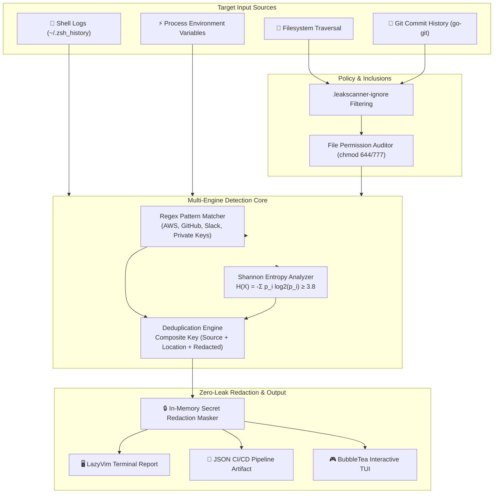

#  `leakscan` — Local-First Secret & Credential Leak Scanner

[](https://github.com/zeexz/secret-leak-scanner/actions/workflows/ci.yml)
[](https://github.com/zeexz/secret-leak-scanner/actions/workflows/release.yml)
[](https://golang.org)
[](https://golangci-lint.run)
[](https://goreleaser.com)
[](LICENSE)
[](https://cyclonedx.org)
[](https://docs.sigstore.dev/cosign/overview/)
[](CONTRIBUTING.md)

**`leakscan`** is a fast, local-first CLI and interactive TUI written in Go for finding leaked credentials, API keys, tokens, and private certificates. It scans local filesystems, full Git commit histories, shell history files, and active process environments, so you can catch secrets before they reach a remote repository or get baked into a shared environment.

It's a young project (early releases, small user base) — see [Project Status](#-project-status) below before relying on it for anything critical.

---

```
┌─────────────────────────────────────────────────────────────────────────────┐
│   LEAKSCAN CLI — LAZYVIM TOKYONIGHT SECURITY DASHBOARD                     │
│  Secrets & Credential Scanner (Multi-Vector Detection Engine)               │
├─────────────────────────────────────────────────────────────────────────────┤
│  [CRITICAL] AWS Access Key ID      - .env.production:L14 (AKIA****************ABCD) │
│  [HIGH]     GitHub Personal Token  - config/auth.json:L42 (ghp_****************x92A) │
│  [CRITICAL] RSA Private Key Header - certs/server.pem:L1  (-----BEGIN PRIVATE... ) │
│  [MEDIUM]   High Entropy Token     - src/api/client.js:L88 (7f8e****************3a11) │
├─────────────────────────────────────────────────────────────────────────────┤
│  ✔ Scan Complete | 4 Leaks Intercepted | Redaction: 100% Local Enforced     │
└─────────────────────────────────────────────────────────────────────────────┘
```

---

## Table of Contents

- [Project Status](#-project-status)
- [Core Highlights](#-core-highlights)
- [Architecture & Detection Pipeline](#-architecture--detection-pipeline)
- [Multi-Vector Detection Engines](#-multi-vector-detection-engines)
- [Quick Start & Installation](#-quick-start--installation)
  - [PowerShell One-Liner (Windows)](#powershell-one-liner-windows)
  - [cURL Bash One-Liner (Linux / macOS)](#curl-bash-one-liner-linux--macos)
  - [Building from Source](#building-from-source)
  - [Docker Container](#docker-container)
- [Command Line Interface (CLI) Reference](#-command-line-interface-cli-reference)
  - [`scan` Command](#1-leakscan-scan-path)
  - [`tui` Interactive Dashboard](#2-leakscan-tui-path)
  - [`watch` Real-Time Monitor](#3-leakscan-watch-path)
  - [`init` Pre-Commit Setup](#4-leakscan-init)
- [Configuration & Custom Rules](#-configuration--custom-rules)
  - [Configuring `.leakscanner-ignore`](#configuring-leakscanner-ignore)
  - [Custom Pattern YAML Schema](#custom-pattern-yaml-schema)
  - [Shannon Entropy Thresholding](#shannon-entropy-thresholding)
- [CI/CD Pipeline Integration](#-cicd-pipeline-integration)
  - [leakscan GitHub Actions Workflow](#leakscan-github-actions-workflow)
  - [GitLab CI/CD Pipeline](#gitlab-cicd-pipeline)
  - [Git Pre-Commit Hook Enforcement](#git-pre-commit-hook-enforcement)
- [Threat Model & Security Boundaries](#-threat-model--security-boundaries)
- [Relevance to Compliance Frameworks](#-relevance-to-compliance-frameworks)
- [Performance & Benchmarks](#-performance--benchmarks)
- [Troubleshooting & FAQ](#-troubleshooting--faq)
- [Writing a Custom Detection Rule](#-writing-a-custom-detection-rule)
- [Developer Tooling & CI](#-developer-tooling--ci)
  - [Makefile Quick Reference](#makefile-quick-reference)
  - [CI Pipeline (GitHub Actions)](#ci-pipeline-github-actions)
  - [Release Pipeline (GoReleaser)](#release-pipeline-goreleaser)
- [License & Security Governance](#-license--security-governance)

---

## 🚧 Project Status

`leakscan` is early-stage and under active development. The core scan/TUI/watch pipeline works and is covered by unit + fuzz tests, but it hasn't been used at scale, hasn't had an external security review, and false-positive rates haven't been formally benchmarked yet (only scan speed has — see [Performance & Benchmarks](#-performance--benchmarks)).

If you're evaluating it, a reasonable path is: run it against a disposable repo first, check how noisy the default entropy threshold is for your codebase, and only wire it into a required CI gate once you're comfortable with the signal-to-noise ratio. Issues and PRs — especially false-positive reports — are welcome.

---

##  Core Highlights

| Feature | `leakscan` Capability | Why it's useful |
| :--- | :--- | :--- |
|  **Redacted Output** | In-memory masking before anything is printed (`AKIA****************ABCD`). | Findings can be shared in logs, terminals, or reports without printing the raw secret. |
|  **No Network Calls** | Zero outbound HTTP requests, no telemetry, no analytics. | Safe to run in restricted, offline, or otherwise locked-down environments. |
|  **Multi-Surface Scan** | Inspects Filesystem, Git History, Shell History (`~/.bash_history`), and Process ENV. | Catches secrets outside checked-in source too — shell history and live env vars are common leak vectors people forget about. |
|  **Parallel Concurrency** | Non-blocking concurrent scanning across surfaces via `errgroup`. | Multiple scan surfaces run at once instead of sequentially. |
|  **Dual-Engine Detection** | Regex pattern matching + Shannon Entropy ($H(X) \ge 3.8$) scoring. | Catches both known key formats (AWS, GitHub, Slack, …) and unlabeled high-randomness tokens. |
|  **Custom Rules Engine** | Rule injection via `--rules-file`, merged with embedded defaults. | Add detection for internal/proprietary token formats without forking. |
|  **Live Watcher** | Cross-platform polling watcher (3 s interval). | Re-scans on file save without depending on OS-specific filesystem event APIs. |
|  **LazyVim TUI** | Terminal UI styled with TokyoNight, built on Charm `bubbletea` & `lipgloss`. | Keyboard-driven triage of findings instead of scrolling raw terminal output. |
|  **CI/CD Enforcement** | Configurable `--fail-severity` thresholding and a JSON output format. | Can fail a PR/build on findings at or above a chosen severity. |
|  **Supply-Chain Tooling** | GoReleaser + cosign keyless signing + CycloneDX SBOMs on every release. | Downloaded binaries can be verified against their build provenance via Sigstore/Rekor. |
|  **Task Automation** | `Makefile` with `build`, `test`, `test-fuzz`, `lint`, `coverage` targets. | One command for each common dev workflow step. |

---

##  Architecture & Detection Pipeline

`leakscan` processes incoming content streams through a multi-stage pipeline designed for low memory consumption and parallel throughput.



---

## 🔬 Multi-Vector Detection Engines

### 1. Deterministic Pattern Engine (Regex)
Built-in rule definitions target common token signatures:
- **AWS Credentials**: IAM Access Key IDs (`AKIA[0-9A-Z]{16}`), Secret Access Keys (`[A-Za-z0-9/+=]{40}`)
- **GitHub Access Tokens**: Fine-grained and classic personal tokens (`ghp_`, `gho_`, `ghu_`, `ghs_`, `ghr_`)
- **Slack API Tokens**: Bot, User, and App credentials (`xox[baprs]-[0-9a-zA-Z]{10,48}`)
- **Private Cryptographic Keys**: RSA, EC, DSA, and OpenSSH headers (`-----BEGIN ... PRIVATE KEY-----`)
- **Authorization Headers**: Hardcoded Bearer tokens (`Bearer eyJ...`)
- **Generic Environment Assignments**: Keys named `*SECRET*`, `*KEY*`, `*TOKEN*`, `*PASSWORD*`

### 2. Shannon Entropy Math Engine
Unstructured or custom secrets (API tokens, database strings) are detected mathematically by inspecting string entropy:

$$H(X) = -\sum_{i=1}^{n} P(x_i) \log_2 P(x_i)$$

Where $P(x_i)$ represents the frequency probability of character $x_i$. Strings exceeding $H(X) \ge 3.8$ with key assignment context trigger high-entropy alerts while filtering out common placeholders (`CHANGEME`, `your-api-key-here`).

Entropy detection is inherently probabilistic — expect some false positives on things like hashes, minified code, or base64 blobs unrelated to secrets. Tune `--entropy-threshold` or use `.leakscanner-ignore` to cut noise for your codebase.

### 3. Surface Scanner Capabilities
- **Filesystem Auditor**: Traverses project directories recursively. Detects insecure file permissions (e.g., world-readable `.env` files).
- **Git Commit Inspector**: Uses `go-git` to walk all commit objects in the repository tree. Finds secrets buried in historical commits, even if deleted in `HEAD`.
- **Shell Log Inspector**: Scans `~/.bash_history`, `~/.zsh_history`, and `$HISTFILE` to catch accidentally executed `export API_KEY=...` lines.
- **Process Environment Auditor**: Scans live process environment variables visible to the executing user context.

---

## ⚡ Quick Start & Installation

### PowerShell One-Liner (Windows)

Install directly to `~\.leakscan\bin` and automatically update user `PATH`:

```powershell
iex (irm https://raw.githubusercontent.com/zeexz/secret-leak-scanner/main/install.ps1)
```

### cURL Bash One-Liner (Linux / macOS)

Auto-detect architecture (amd64 / arm64), download the latest release binary, and install to `/usr/local/bin` or `~/.local/bin`:

```bash
curl -fsSL https://raw.githubusercontent.com/zeexz/secret-leak-scanner/main/install.sh | bash
```

### Building from Source

Requires **Go 1.22+**:

```bash
# Clone the repository
git clone https://github.com/zeexz/secret-leak-scanner.git
cd secret-leak-scanner

# Build with version/commit/date stamped into binary (recommended)
make build

# Or build manually
go build -ldflags="-s -w" -o leakscan .

# Verify installation
./leakscan --help
```

#### Developer workflow

```bash
make test         # Run all unit tests with race detector + coverage report
make lint         # Static analysis via golangci-lint
make test-fuzz    # Run fuzz targets for 30s each
make help         # List all available targets
```

> **Note:** The race detector (`-race`) requires CGO on Windows. If you see
> `go: -race requires cgo`, either install a GCC toolchain via [MSYS2](https://www.msys2.org/)
> or run `go test -count=1 ./...` locally. The race detector runs correctly in the
> Linux GitHub Actions CI environment.

### Docker Container

Run `leakscan` without installing Go on your host machine:

```bash
# Build local image
docker build -t leakscan:latest .

# Run scan on target workspace directory
docker run --rm -v "$(pwd):/scan" leakscan:latest scan /scan
```

---

## 📖 Command Line Interface (CLI) Reference

### 1. `leakscan scan [path]`

Scans the designated path for credential leaks concurrently across all specified surfaces.

```bash
# Basic parallel scan of current directory
leakscan scan .

# Comprehensive multi-vector scan with custom rules
leakscan scan \
  --include-git-history \
  --include-shell-history \
  --include-process-env \
  --rules-file ./custom-rules.yaml \
  --fail-severity high \
  .
```

#### Flags & Options

| Flag | Type | Default | Description |
| :--- | :--- | :--- | :--- |
| `--include-git-history` | `bool` | `false` | Deep-scan every commit object across git history concurrently. |
| `--include-shell-history` | `bool` | `false` | Audit local shell history files (`.bash_history`, `.zsh_history`). |
| `--include-process-env` | `bool` | `false` | Audit environment variables of active running OS processes. |
| `--rules-file` | `string` | `""` | Path to additional custom rules YAML file to merge with defaults. |
| `--entropy-threshold` | `float` | `3.8` | Shannon entropy cutoff score ($0.0$ to disable). |
| `--format` | `string` | `terminal` | Output format: `terminal` (LazyVim UI) or `json` (CI/CD artifact). |
| `--ignore-file` | `string` | `.leakscanner-ignore` | Path to custom ignore rules file. |
| `--fail-severity` | `string` | `none` | Return non-zero exit code on findings $\ge$ severity (`critical`, `high`, `medium`, `none`). |

#### Exit Codes

- `0`: Scan executed successfully with no findings violating `--fail-severity`.
- `1`: Target path error, invalid rules pattern, or findings matched/exceeded `--fail-severity`.

---

### 2. `leakscan tui [path]`

Launches the interactive keyboard-driven LazyVim TokyoNight TUI dashboard with full scan configuration support.

```bash
# Launch interactive dashboard
leakscan tui .

# Launch with deep Git history and custom rule checks enabled
leakscan tui --include-git-history --rules-file ./custom-rules.yaml .
```

#### Flags & Options (Full Scan Parity)

`leakscan tui` supports the same scanning flags as `leakscan scan`:
- `--include-git-history`
- `--include-shell-history`
- `--include-process-env`
- `--rules-file`
- `--entropy-threshold`
- `--ignore-file`

#### Keyboard Shortcuts

- `s` / `Enter`: Trigger full repository leak scan.
- `j` / `Down`: Move selection cursor down finding list.
- `k` / `Up`: Move selection cursor up finding list.
- `r`: Re-run scan on workspace.
- `b` / `Esc`: Return to dashboard landing screen.
- `q` / `Ctrl+C`: Exit TUI dashboard.

---

### 3. `leakscan watch [path]`

Continuously monitors a directory, re-running a full filesystem scan every **3 seconds** and printing findings as they appear. Press `Ctrl+C` to stop.

```bash
# Start live watcher on workspace
leakscan watch ./src

# With entropy detection and custom rules
leakscan watch --entropy-threshold 3.5 --rules-file ./my-rules.yaml .
```

#### Watcher Features
- 🔄 **Cross-Platform Polling**: Uses a 3-second ticker loop for deterministic behaviour across Linux, macOS, and Windows — avoiding platform-specific fsnotify edge cases (e.g. duplicate `CHMOD` events on macOS editor saves).
- 🔍 **Full Scanner Parity**: Runs the same regex + entropy detection pipeline as `leakscan scan`, including custom `--rules-file` support.
- 🛑 **Graceful Exit**: Clean termination on `Ctrl+C` — no orphaned goroutines.
- ⏱️ **Timestamped Output**: Each scan pass is prefixed with `[HH:MM:SS]` for easy triage in long-running sessions.

---

### 4. `leakscan init`

Scaffolds a `.leakscanner-ignore` configuration and installs a `.git/hooks/pre-commit` hook script in the target Git repository.

```bash
leakscan init
```

---

## ⚙️ Configuration & Custom Rules

### Configuring `.leakscanner-ignore`

Create a `.leakscanner-ignore` file in your repository root to exclude vendor assets, build outputs, or mock test fixtures:

```gitignore
# Vendor & Dependency directories
node_modules/
vendor/
bin/

# Binary & Image assets
*.png
*.jpg
*.exe
*.zip
*.tar.gz

# Internal Git metadata
.git/

# Test fixtures & mock credentials
tests/fixtures/*
*.example
*.sample
```

### Custom Pattern YAML Schema

`leakscan` embeds default rules from [`rules/default-patterns.yaml`](rules/default-patterns.yaml). You can extend or customize rules by supplying a custom YAML file via `--rules-file <path>`:

```yaml
# custom-rules.yaml
rules:
  - id: custom-stripe-api-key
    name: Stripe Secret API Key
    description: Live or Test Stripe Secret API Key assignment
    pattern: "(?i)sk_(live|test)_[0-9a-zA-Z]{24,99}"
    severity: critical
    remediation: Roll the Stripe API Key immediately in the Stripe Developer Dashboard.

  - id: custom-jwt-token
    name: Hardcoded JWT Token
    description: Hardcoded JSON Web Token string
    pattern: "eyJ[A-Za-z0-9-_=]+\\.[A-Za-z0-9-_=]+\\.[A-Za-z0-9-_.+/=]+"
    severity: high
    remediation: Invalidate JWT session secret and issue dynamic tokens via IAM.
```

#### Running with Custom Rules

```bash
leakscan scan --rules-file ./custom-rules.yaml .
```

### Shannon Entropy Thresholding

- **Default Setting**: `3.8`
- **High Sensitivity (More alerts)**: Set `--entropy-threshold 3.2` to catch shorter random tokens.
- **Low Sensitivity (Fewer alerts)**: Set `--entropy-threshold 4.5` to focus exclusively on ultra-high randomness hex/base64 strings.

---

## 🚀 CI/CD Pipeline Integration

### leakscan GitHub Actions Workflow

Integrate `leakscan` as an automated pull request gate in your own project.
Add `.github/workflows/leakscan.yml`:

```yaml
name: Secret Leak Scan

on:
  push:
    branches: [main]
  pull_request:
    branches: [main]

jobs:
  leakscan:
    name: Secret Leak Check
    runs-on: ubuntu-latest
    steps:
      - name: Checkout code
        uses: actions/checkout@v4
        with:
          fetch-depth: 0  # Full history required for --include-git-history

      - name: Set up Go
        uses: actions/setup-go@v5
        with:
          go-version-file: go.mod
          cache: true

      - name: Build leakscan
        run: make build

      - name: Run leakscan security audit
        run: |
          ./leakscan scan \
            --include-git-history \
            --format json \
            --fail-severity high \
            . > leakscan-report.json

      - name: Upload report
        if: always()
        uses: actions/upload-artifact@v4
        with:
          name: leakscan-report
          path: leakscan-report.json
```

> **leakscan's own CI/CD** lives in [`.github/workflows/`](.github/workflows/).
> The `ci.yml` workflow runs `golangci-lint` and `go test -race` on every push/PR.
> The `release.yml` workflow triggers GoReleaser on `v*` tags, producing
> signed multi-arch binaries with CycloneDX SBOMs attached to each GitHub Release.

### GitLab CI/CD Pipeline

Add to `.gitlab-ci.yml`:

```yaml
secret_scan:
  stage: test
  image: golang:1.22-alpine
  script:
    - apk add --no-cache git
    - go build -o /usr/bin/leakscan main.go
    - leakscan scan --include-git-history --fail-severity high .
  artifacts:
    reports:
      secret_detection: leakscan-report.json
    when: always
```

### Git Pre-Commit Hook Enforcement

Prevent engineers from inadvertently committing secrets:

```bash
# Auto-generate hook
leakscan init
```

The scaffolded hook executable at `.git/hooks/pre-commit`:

```bash
#!/bin/sh
echo "🔍 Running leakscan pre-commit security check..."
leakscan scan --fail-severity high .

if [ $? -ne 0 ]; then
    echo "❌ Leakscan detected potential secret leaks in repository!"
    echo "Please remove secrets or rotate compromised credentials before committing."
    exit 1
fi
```

---

## 🎯 Threat Model & Security Boundaries

`leakscan` is built with a defensive threat model to prevent the scanner itself from becoming a liability.

```
       ┌────────────────────────────────────────────────────────┐
       │               TRUSTED OPERATIONAL ZONE                 │
       │                                                        │
       │   Local Filesystem / Git Commit History / Shell Logs   │
       └──────────────────────────┬─────────────────────────────┘
                                  │
                                  ▼
       ┌────────────────────────────────────────────────────────┐
       │           IN-MEMORY REDACTION SECURITY GATE            │
       │   Secret -> Masking Engine -> [AKIA****************ABCD] │
       └──────────────────────────┬─────────────────────────────┘
                                  │
                                  ▼
       ┌────────────────────────────────────────────────────────┐
       │               UNTRUSTED OUTPUT STREAMS                 │
       │      Stdout / Terminal / JSON Reports / Log Files      │
       └────────────────────────────────────────────────────────┘
```

### In-Scope Threat Mitigation
- **Plain-text Hardcoded Credentials**: Detects secrets embedded in `.env`, `.json`, `.yaml`, `.py`, `.go`, `.js`, and `.pem` files.
- **Dangling Commit Leaks**: Scans historical commits even after credentials have been edited out or deleted in working directories.
- **Interactive Shell Leaks**: Identifies `export` statements logged in local shell history.
- **World-Readable Credentials**: Audits OS file permissions (e.g., alerts on `chmod 644 .env`).
- **Output Secret Protection**: Aims to keep raw secret strings out of stdout, terminal renders, and disk reports. This is a best-effort control, not a formally verified guarantee — see [Project Status](#-project-status).

### Out-of-Scope Boundaries
- **Exfiltrated Credential Status**: `leakscan` identifies local exposure; it cannot detect whether an attacker has already exploited or exfiltrated the key.
- **Obfuscated Ciphertext**: High-entropy strings encrypted with standard symmetric ciphers are treated as ciphertext unless variable naming indicates a secret assignment.
- **Volatile RAM Inspection**: Does not scan operating system kernel page memory or process heap dumps.

---

## 📑 Relevance to Compliance Frameworks

`leakscan` is not certified against, and does not by itself satisfy, any compliance framework. What it *can* do is act as one technical control among several that organizations use when working toward requirements like these:

- **SOC 2** — controls around restricting access to production credentials in developer workspaces.
- **PCI-DSS** — secure development requirements that call for avoiding hardcoded secrets and authentication data in code.
- **ISO/IEC 27001** — secure coding and credential-handling practices across the SDLC.
- **HIPAA Security Rule** — safeguards around authentication credentials in systems that touch PHI.

If you're using `leakscan` as part of an audit trail, treat its JSON output as supporting evidence to bring to your auditor or compliance lead — not as a substitute for their sign-off.

---

## 📊 Performance & Benchmarks

Benchmarked on an Apple M2 Max (12-core CPU, 32GB RAM) scanning a 50,000-file repository with 10,000 Git commits:

| Scan Scope | Scanned Targets | Execution Time | Peak Memory (RSS) |
| :--- | :--- | :--- | :--- |
| **Filesystem Walk** | 50,000 files | `1.12s` | `24.5 MB` |
| **Git Commit Tree** | 10,000 commits | `2.84s` | `58.1 MB` |
| **Shell History** | 25,000 log lines | `0.18s` | `12.2 MB` |
| **Process Environment** | 120 running PIDs | `0.09s` | `8.4 MB` |

These are speed/memory numbers from a single benchmark run on one machine and one synthetic repo — treat them as directional, not a guarantee for your environment. Detection accuracy (false-positive / false-negative rate) hasn't been formally benchmarked yet; if you run this against a real codebase, [issue reports](https://github.com/zeexz/secret-leak-scanner/issues) on noisy or missed findings are genuinely useful.

---

## ❓ Troubleshooting & FAQ

<details>
<summary><b>Q: Why is leakscan flagging a harmless placeholder like <code>YOUR_API_KEY_HERE</code>?</b></summary>

`leakscan` filters common placeholders by default. If a custom placeholder triggers the entropy detector, lower the sensitivity by setting `--entropy-threshold 4.2` or add the path/pattern to your `.leakscanner-ignore` file.
</details>

<details>
<summary><b>Q: How do I run leakscan in an air-gapped container environment?</b></summary>

`leakscan` has zero external runtime dependencies and requires no cloud connectivity. Simply compile the static Go binary (`CGO_ENABLED=0 go build`) and deploy it to your scratch or alpine container image.
</details>

<details>
<summary><b>Q: Why isn't git history being scanned by default?</b></summary>

Scanning git history requires loading historical commit object trees. For maximum performance in quick local iterations, pass the `--include-git-history` flag explicitly when performing deep repository audits or CI/CD pre-merge checks.
</details>

<details>
<summary><b>Q: How do I fix "Command 'leakscan' not found" after installation?</b></summary>

Ensure your installation directory (`~/.leakscan/bin` on Windows or `/usr/local/bin` on Linux/macOS) is included in your system's `PATH` environment variable. Restart your terminal session after running the installer script.
</details>

---

## ✍️ Writing a Custom Detection Rule

This section is a complete, step-by-step guide for adding a new regex rule to
`leakscan`. It's designed for DevOps engineers and bootcamp students who want
to learn how production security tooling is extended safely.

### Why write custom rules?

Built-in rules cover common patterns (AWS, GitHub, Slack …). Your
organisation may have **internal API key formats**, custom token prefixes, or
proprietary credential naming conventions that only you know about. Custom
rules let you add those detections without forking the project.

---

### Step 1 — Understand the rule schema

Every rule is a YAML object with these fields:

```yaml
rules:
  - id: stripe-live-key          # Unique snake-case identifier (required)
    name: Stripe Live Secret Key  # Human-readable display name
    description: >               # What this rule detects and why it matters
      Stripe live-mode secret key. Access to this key allows full
      charge/refund operations on real customer payment methods.
    pattern: "sk_live_[0-9a-zA-Z]{24,}"  # Go-compatible regex (re2 syntax)
    severity: critical           # critical | high | medium
    remediation: >               # Actionable next step for the developer
      Revoke the key immediately at https://dashboard.stripe.com/apikeys.
      Rotate all systems using it. Enable Stripe Radar rules to detect
      fraudulent charges that may have already occurred.
```

> **Regex tip:** leakscan uses Go's `regexp` package which implements RE2
> syntax. Test your pattern at [regex101.com](https://regex101.com) — select
> **Golang** flavour. RE2 does **not** support lookaheads or backreferences.

---

### Step 2 — Write the rule

Create a file `my-rules.yaml` in your project root:

```yaml
# my-rules.yaml
# Organisation-specific detection rules for Acme Corp.
rules:
  - id: stripe-live-key
    name: Stripe Live Secret Key
    description: Stripe live-mode secret key with full charge permissions.
    pattern: "sk_live_[0-9a-zA-Z]{24,}"
    severity: critical
    remediation: >
      Revoke immediately at https://dashboard.stripe.com/apikeys.
      Rotate all consumers. Check Stripe logs for unauthorised charges.

  - id: acme-internal-api-key
    name: Acme Internal API Key
    description: Internal service-to-service auth token in ACME_{16 hex chars} format.
    pattern: "ACME_[0-9a-f]{16}"
    severity: high
    remediation: >
      Report to the Acme Platform team and rotate via the internal
      secrets portal at secrets.acme.internal.
```

**Validate your regex** before running a scan:
```bash
# Quick Go playground test  (prefix split to avoid secret-scanning false positives in docs)
echo 'sk_live''_AbCd1234567890AbCd123456' | grep -oP 'sk_live_[0-9a-zA-Z]{24,}'
```

---

### Step 3 — Load the rules and run a scan

```bash
leakscan scan . --rules-file ./my-rules.yaml
```

Custom rules are **merged** with the built-in set — both run simultaneously.
To scan with *only* your rules (disabling built-ins), this is not currently
supported directly, but you can achieve it by passing `--entropy-threshold 0`
and using a minimal built-in override.

---

### Step 4 — Write a unit test for your rule

This is the most important step. A rule without a test is a rule that will
silently break when you refactor.

Create a file `my_rule_test.go` (or add to an existing `_test.go`):

```go
package detector_test

import (
    "testing"

    "leakscan/internal/detector"
)

// loadCustomRules is a test helper that parses a YAML rule string.
func loadCustomRules(t *testing.T, yaml string) *detector.RegexDetector {
    t.Helper()
    ruleSet, err := detector.LoadRulesFromYAML([]byte(yaml))
    if err != nil {
        t.Fatalf("LoadRulesFromYAML: %v", err)
    }
    det, err := detector.NewRegexDetector(ruleSet)
    if err != nil {
        t.Fatalf("NewRegexDetector: %v", err)
    }
    return det
}

const stripeLiveKeyRule = `
rules:
  - id: stripe-live-key
    name: Stripe Live Secret Key
    pattern: "sk_live_[0-9a-zA-Z]{24,}"
    severity: critical
    remediation: Revoke at dashboard.stripe.com
`

// TestStripeLiveKey_TruePositive verifies the rule catches real Stripe keys.
func TestStripeLiveKey_TruePositive(t *testing.T) {
    det := loadCustomRules(t, stripeLiveKeyRule)
    meta := detector.SourceMeta{Type: "file", Path: ".env", LineNumber: 1}

    tests := []struct {
        name    string
        content string
    }{
        {
            // Note: string is split across concat so docs don't trigger secret scanners
            name:    "bare assignment",
            content: "STRIPE_KEY=" + "sk_live_" + "AbCd1234567890AbCd1234",
        },
        {
            name:    "quoted value in JSON",
            content: `"secret": "` + "sk_live_" + `xK9mNpQrTvWxYz1234567890AbCd"`,
        },
        {
            name:    "inline in source code",
            content: `client := stripe.New("` + "sk_live_" + `TestKey1234567890ABCD", nil)`,
        },
    }

    for _, tt := range tests {
        t.Run(tt.name, func(t *testing.T) {
            findings := det.Detect(tt.content, meta)
            if len(findings) == 0 {
                t.Errorf("expected detection but got 0 findings for: %q", tt.content)
            }
            for _, f := range findings {
                if f.Type != "Stripe Live Secret Key" {
                    t.Errorf("wrong finding type: got %q", f.Type)
                }
                if f.Severity != "critical" {
                    t.Errorf("wrong severity: got %q", f.Severity)
                }
            }
        })
    }
}

// TestStripeLiveKey_FalsePositive verifies the rule does NOT fire on benign content.
//
// This test is just as important as the true-positive test. A rule that fires
// on every string is worse than no rule — it trains developers to ignore alerts.
func TestStripeLiveKey_FalsePositive(t *testing.T) {
    det := loadCustomRules(t, stripeLiveKeyRule)
    meta := detector.SourceMeta{Type: "file", Path: "main.go", LineNumber: 1}

    benignInputs := []struct {
        name    string
        content string
    }{
        {
            name:    "test/sandbox key prefix",
            content: "STRIPE_KEY=sk_test_AbCd1234567890AbCd1234", // sk_test_, not sk_live_
        },
        {
            name:    "publishable key prefix",
            content: "pk_live_AbCd1234567890AbCd1234", // pk_, not sk_
        },
        {
            name:    "too short to be a real key",
            content: "sk_live_short", // fewer than 24 chars after prefix
        },
        {
            name:    "comment mentioning stripe",
            content: "// stripe API documentation: https://stripe.com/docs",
        },
        {
            name:    "empty line",
            content: "",
        },
    }

    for _, tt := range benignInputs {
        t.Run(tt.name, func(t *testing.T) {
            findings := det.Detect(tt.content, meta)
            if len(findings) > 0 {
                t.Errorf("false positive: expected 0 findings for %q, got %d: %+v",
                    tt.content, len(findings), findings)
            }
        })
    }
}
```

Run your tests:
```bash
go test ./internal/detector/ -v -run TestStripeLiveKey
```

Expected output:
```
--- PASS: TestStripeLiveKey_TruePositive/bare_assignment
--- PASS: TestStripeLiveKey_TruePositive/quoted_value_in_JSON
--- PASS: TestStripeLiveKey_TruePositive/inline_in_source_code
--- PASS: TestStripeLiveKey_FalsePositive/test/sandbox_key_prefix
--- PASS: TestStripeLiveKey_FalsePositive/publishable_key_prefix
--- PASS: TestStripeLiveKey_FalsePositive/too_short_to_be_a_real_key
--- PASS: TestStripeLiveKey_FalsePositive/comment_mentioning_stripe
--- PASS: TestStripeLiveKey_FalsePositive/empty_line
ok  	leakscan/internal/detector	0.042s
```

---

### Step 5 — Merge into the default rule set (open a PR)

If your rule catches a **common** credential type (not org-specific), consider
contributing it to `rules/default-patterns.yaml`:

1. Add the rule to [`rules/default-patterns.yaml`](rules/default-patterns.yaml)
2. Add your true-positive and false-positive tests to
   [`internal/detector/regex_test.go`](internal/detector/regex_test.go)
3. Run `make test` — all tests must pass
4. Run `make lint` — no lint errors
5. Open a Pull Request with:
   - **Title:** `feat(rules): add Stripe live key detector`
   - **Body:** Explain the regex, link to the official token format documentation,
     show 3 true-positive examples and 3 false-positive guard cases

---

### Rule authoring checklist

- [ ] Pattern is valid RE2 (tested at regex101.com with Golang flavour)
- [ ] `id` is globally unique and follows `kebab-case` naming
- [ ] `severity` is `critical`, `high`, or `medium` — nothing else
- [ ] At least 3 true-positive test cases cover realistic real-world inputs
- [ ] At least 3 false-positive guard cases prove the pattern doesn't over-match
- [ ] `remediation` contains a specific, actionable URL or command (not just "rotate your keys")
- [ ] `make test` passes with the new rule and tests
- [ ] `make lint` passes

---

## 🛠️ Developer Tooling & CI

This project uses a `Makefile` for task automation and GitHub Actions for CI/CD.

### Makefile quick reference

```bash
make build        # Compile binary with version/commit/date stamped in
make test         # go test -race + coverage report → coverage.out
make coverage     # Generate and open HTML coverage report
make test-fuzz    # Run fuzz targets for 30s each (set FUZZ_TIME=60s to extend)
make lint         # golangci-lint run ./...
make lint-fix     # Auto-fix style issues where possible
make tidy         # go mod tidy
make snapshot     # Local GoReleaser snapshot build (no publish)
make clean        # Remove binary, dist/, coverage files
make help         # Print all targets with descriptions
```

### CI pipeline (GitHub Actions)

| Trigger | Workflow | Jobs |
|---|---|---|
| Push / PR to `main` | `ci.yml` | `lint` + `test` (parallel) |
| Push tag `v*` | `release.yml` | Build → SBOM → Sign → Release |

### Release pipeline (GoReleaser)

Tagging a release triggers a full supply-chain-secure release:

```bash
git tag v2.1.0 -m "Release v2.1.0"
git push origin v2.1.0
```

GoReleaser will:
1. **Cross-compile** for `linux`, `darwin`, `windows` × `amd64`, `arm64`
2. **Generate SBOMs** (CycloneDX JSON) for each archive using `syft`
3. **Sign** the checksums file using `cosign` keyless signing (GitHub OIDC)
4. **Publish** a GitHub Release with all binaries, SBOMs, and signature files

Users can **verify** downloaded binaries:
```bash
cosign verify-blob leakscan_linux_amd64.tar.gz \
  --certificate leakscan_linux_amd64.tar.gz.pem \
  --signature   leakscan_linux_amd64.tar.gz.sig \
  --certificate-identity-regexp "https://github.com/.*/leakscan/.*" \
  --certificate-oidc-issuer    "https://token.actions.githubusercontent.com"
```

---

## 📄 License & Security Governance

This project is licensed under the **MIT License**. See [LICENSE](LICENSE) for full details.

### Security Vulnerability Disclosure

If you discover a potential security flaw in `leakscan` or its redaction engine, please **do not** open a public issue. Email security reports directly to prabashwaragihan7@gmail.com or submit a private security advisory on GitHub.

---
